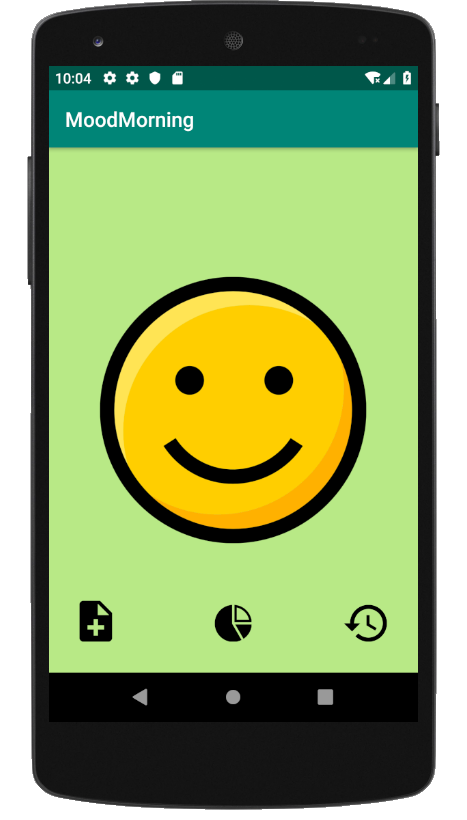
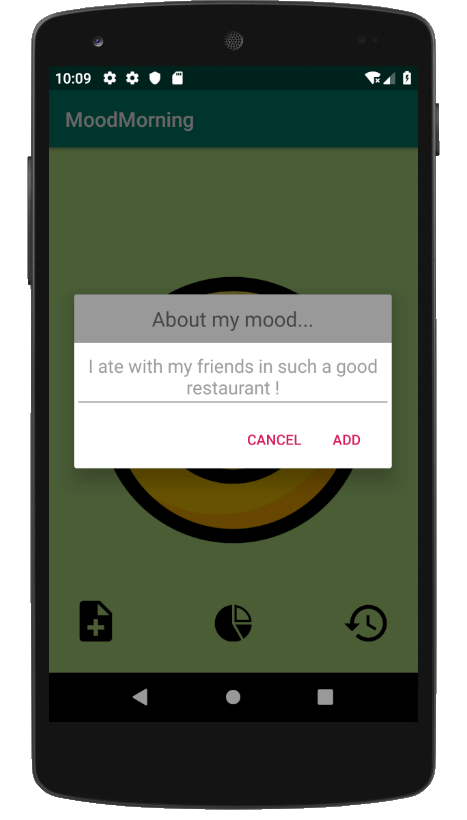
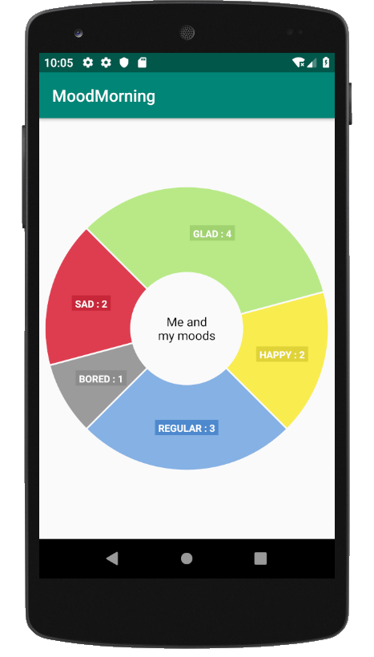
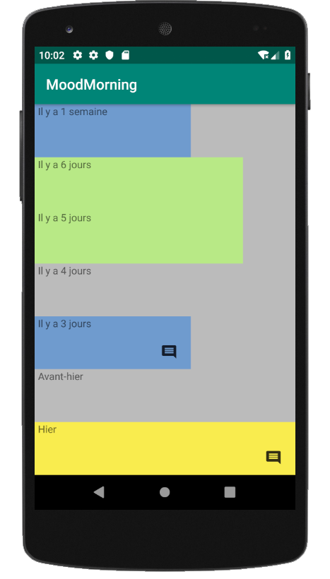

<h1>Mood Morning</h1>
Scholar application
Its goal is to record daily mood and report the 7 last ones

<h1>Screenshots</h1>

<h1>Motivation</h1>
This app was part of the mandatory app to realize to achieve the training. 
First app of the training.

<h1>Features</h1>
Allows to record our mood of the day. 
A comment can be add. 
We can check the stats on the "stats" screen as well as the history of the 7 last days on the "history" screen. 
The comment we left can seen from the "history" screen.

2 langages available : english/french

<h1>How to use the app ?</h1>

**Choose mood of the day and comment** :
- swipe up/down to choose the accurate face
- click the "+" button to add a comment
 

**Check stats and history** :
- swipe to the right
- you can undo the deletion of an item clicking on the Undo button in the bottom snackbar (displayed for 3s)
 

<h1>Technical considerations</h1>
These libraries have been used to develop this app : 
ThreeTenABP :     implementation 'com.jakewharton.threetenabp:threetenabp:1.1.1'
HelloCharts :     implementation 'com.github.lecho:hellocharts-library:1.5.8@aar' 

SharedPreferences have been used to save/store data.

<h1>Credits</h1>
Bertrand Ripoche